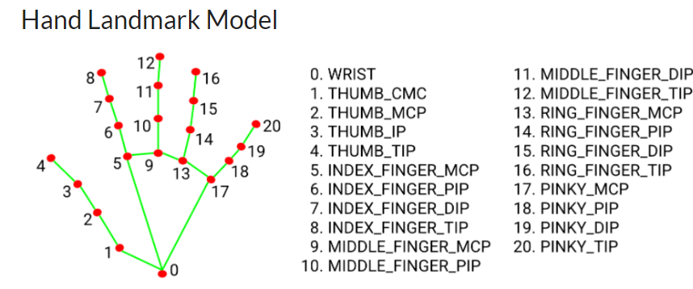
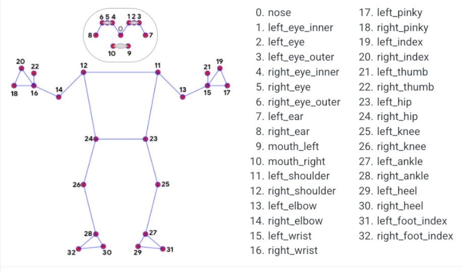

<!-- PROJECT LOGO -->
 

  <h1 align="center">Advance-Image-processing ✨</h1>

 
  
<!-- TABLE OF CONTENTS -->

  
Project Table of Contents

  <ol>
    <li>
      <a href="#about-the-project">About The Project</a>
    </li>
    <li>
      <a href="#getting-started">Contents</a>
      <ul>
        <li><a href="##prerequisites">Prerequisites</a></li>
        <li><a href="##handtracking">Hand Tracking</a></li>
        <li><a href="##poseestimation">Real time Pose Estimation </a></li>
        <li><a href="##poselandmarks">Pose Landmark Model </a></li>
        <li><a href="##facedetection">Face Detection </a></li>
      </ul>
</li>
</ol>

<!-- ABOUT THE PROJECT-->

# About The Project

This repository include all showcase projects related to advance computer vision and image processing techniques in Python.

 
# Contents

 ## Prerequisites
* Python programming
* Basic Knowledge of 
<a href="https://pypi.org/project/opencv-python/">opencv</a>
,<a href="https://google.github.io/mediapipe/getting_started/python.html">mediapipe</a>

## Hand Landmark Model

 Media pipe is an open-source cross-platform framework for building multimodel machine learning pipelines. It can be used to implement cutting-edge models like human face detection, multi-hand tracking, hair segmentation, object detection and tracking, and so on.
mediapipe is a framework mainly used for building audio, video, or any time series data. With the help of the MediaPipe framework, we can build very impressive pipelines for different media processing functions.

Some of the major applications of MediaPipe.

* Multi-hand Tracking
* Face Detection
* Object Detection and Tracking
* Objectron: 3D Object Detection and Tracking
* AutoFlip: Automatic video cropping pipeline etc.

# Real time Pose Estimation
In this project 2 I have make a Python Object class  pose estimation module using opencv and 
mediapipe.Pose estimation is a computer vision technique to track the movements of a person or an object. This is usually performed by finding the location of key points for the given objects. Based on these key points we can compare various movements and postures and draw insights. Pose estimation is actively used in the field of augmented reality, animation, gaming, and robotics.

# Pose Landmark Model
Human pose estimation from video or a real-time feed plays a crucial role in various fields such as full-body gesture control, quantifying physical exercise, and sign language recognition. For example, it can be used as the base model for fitness, yoga, and dance applications. It finds its major part in augmented reality.

Here is the result of realtime pose estimation of my module.

# Face Detection

The model for 3D face landmarks has been employed using transfer learning and it is trained on a network with different objectives: the network predicts 3D landmark coordinates on synthetic rendered data. The resulting network performed reasonably well on real-world data.

The 3D landmark network takes input as a cropped video frame without additional depth input. The model outputs the positions of the 3D points, reasonably aligned in the input.
The demo of face detection module is in below.

# Face Mesh Detection

In face detection using mediapipe we were unble to visualize the other key elements of faces such as
the major facial key points so to sove this issue we use another method which is to detect all 468 facial landmarks points.

